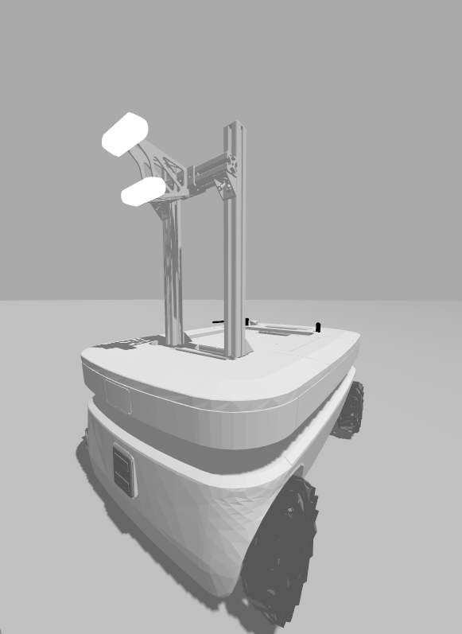
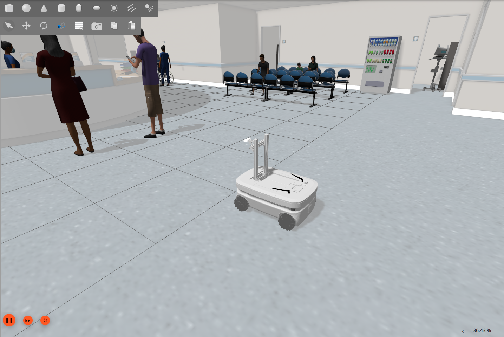
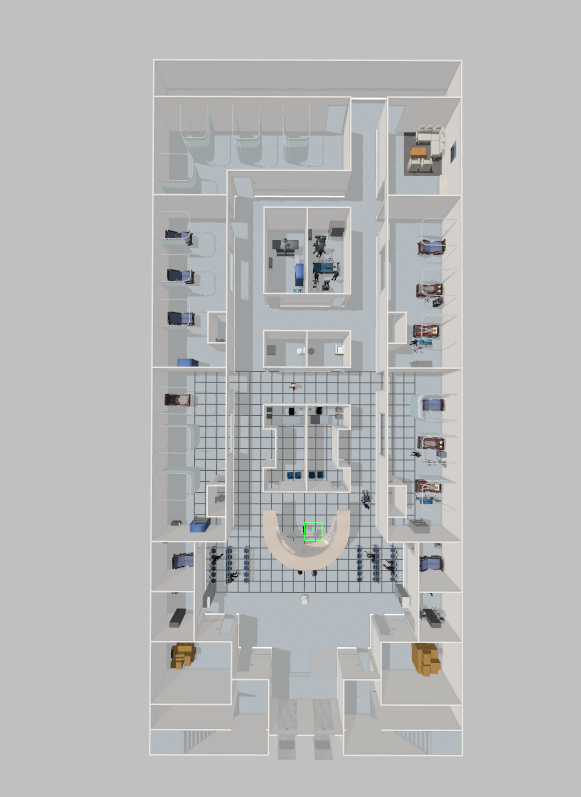
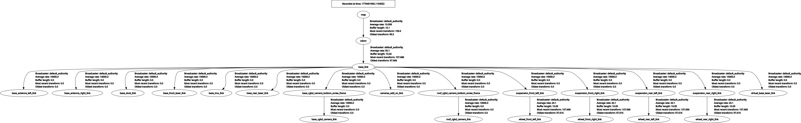
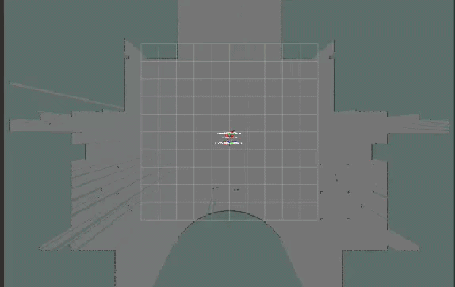
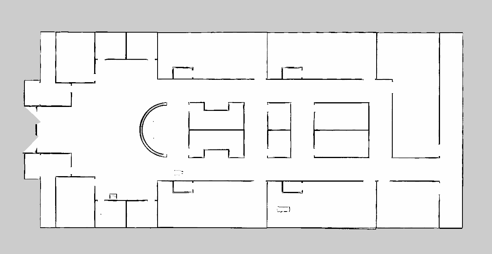
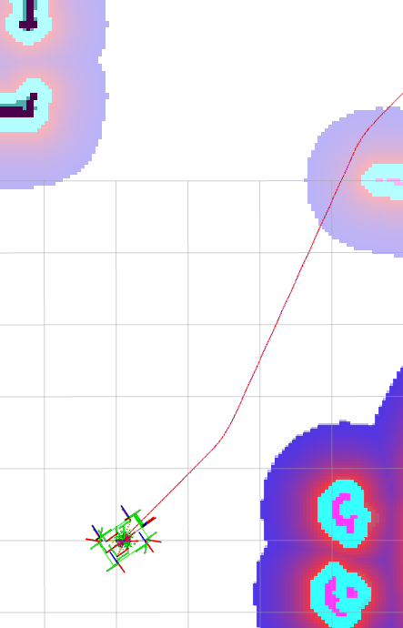
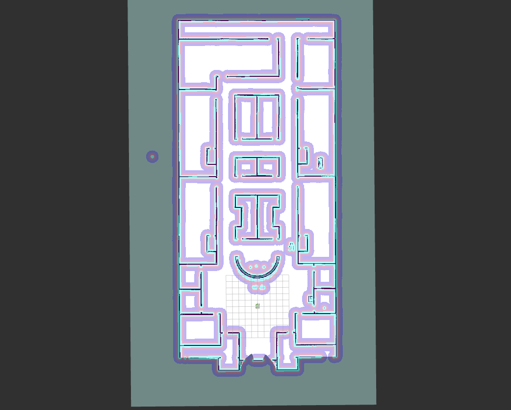

# PROJECT ROBOT OMNI
# ROS 2 Nav2: Autonomous Omni-directional Hospital Navigation Robot

**Tác giả:** Nguyễn Anh Hào & Trần Minh Cương  
**Email:** nahhao74@gmail.com , tmcuong0507@gmail.com

---

Dự án này triển khai hệ thống điều hướng tự hành toàn diện cho một robot đa hướng (omni-directional robot) hoạt động trong môi trường mô phỏng bệnh viện (AWS Hospital World). Hệ thống được xây dựng trên nền tảng ROS 2 Jazzy và thư viện Nav2 stack trong môi trường mô phỏng Gazebo.

Điểm nhấn của dự án nằm ở việc giải quyết bài toán động học phức tạp của xe omni trong không gian hẹp. Hệ thống sử dụng Smac A* làm Global Planner để tạo ra các đường đi an toàn, có tính toán đến footprint của robot. Ở cấp độ điều khiển, dự án kết hợp Rotation Shim Controller để xử lý các góc quay ưu tiên, và MPPI Controller để dự đoán và lấy mẫu quỹ đạo trong thời gian thực, giúp robot lách qua các vật cản động một cách mượt mà nhất.

---

## Phạm vi của dự án bao gồm:
1. Xây dựng mô hình robot và môi trường mô phỏng vật lý có độ tin cậy cao.
2. Xử lý tín hiệu đầu vào từ cảm biến (LiDAR, IMU, Camera) và dữ liệu Odometry.
3. Thiết lập hệ thống TF tree chuẩn xác.
4. Xây dựng bản đồ trong môi trường phức tạp (SLAM & Mapping). Sử dụng các thuật toán SLAM hiện đại trên ROS 2 để quét và xây dựng bản đồ Occupancy Grid 2D từ môi trường AWS Hospital World, xử lý nhiễu từ các hành lang dài và các phòng bệnh có cấu trúc giống nhau.
5. Cấu hình các sever phục vụ cho Nav2 để tối ưu hóa quỹ đạo di chuyển và khả năng tránh vật cản động/tĩnh.

---

## Setup

### 1. Yêu cầu hệ thống:
- Ubuntu 24.04
- ROS 2 Jazzy
- Gazebo Simulator
- AWS Robotic Hospital World packages

### 2. Tạo Workspace và cài đặt thư viện:

```bash
# Tạo ROS 2 workspace
mkdir -p ~/ros2_ws/src
cd ~/ros2_ws/src

# Clone repository của dự án
git clone https://github.com/nahhao74/Omni_project.git

# Build
cd ~/ros2_ws
colcon build

# Khai báo đường dẫn
source install/setup.bash
```

### 3. Khởi chạy file launch

```bash
ros2 launch robot_omni localization_launch.py
```

---

## Tính năng & Demo

- Xây dựng bản đồ trong môi trường phức tạp (SLAM & Mapping): Sử dụng các thuật toán SLAM hiện đại trên ROS 2 để quét và xây dựng bản đồ Occupancy Grid 2D từ môi trường AWS Hospital World, xử lý nhiễu từ các hành lang dài và các phòng bệnh có cấu trúc giống nhau.

- Lập kế hoạch đường đi toàn cục với Smac A* (Global Planning): Smac A* Planner tính toán đường đi tối ưu nhất từ vị trí hiện tại đến phòng bệnh mục tiêu. Thuật toán cân nhắc chi phí về khoảng cách cũng như vùng rủi ro, đảm bảo quỹ đạo không bo góc quá gắt gây va chạm tường.

- Điều hướng mượt mà với MPPI & Rotation Shim Controller (Local Control): Rotation Shim giúp robot xoay hướng mặt về phía mục tiêu trước khi tiến. Ngay sau đó, MPPI Controller sẽ liên tục lấy mẫu hàng ngàn quỹ đạo để chọn ra hướng đi linh hoạt nhất, giúp đạt tới vị trí đích với đường đi tối ưu nhất và tránh va chạm.

---

## Acknowledgments

Dự án này được phát triển dựa trên nền tảng của nhiều thư viện mã nguồn mở và tài liệu tham khảo từ cộng đồng ROS. Xin gửi lời cảm ơn đặc biệt đến:

- Cartographer ROS / TurtleBot3: Các file cấu hình Launch và SLAM (như cartographer_node) được xây dựng dựa trên mã nguồn gốc của tác giả Darby Lim (Bản quyền 2019 thuộc Open Source Robotics Foundation, Inc. - Giấy phép Apache 2.0). Cấu trúc gốc đã được tùy biến lại (remapping) để có thể hợp nhất dữ liệu từ hệ thống Lidar kép và Odometry cho robot di chuyển đa hướng.

- Nav2 & MPPI: https://docs.nav2.org/configuration/packages/configuring-mppic.html
- AWS Hospital World: https://github.com/aws-robotics/aws-robomaker-hospital-world.git

---

## Xây dựng mô hình robot

### 1. Hình dạng kích thước
- Loại robot: Xe 4 bánh đa hướng (Omni/Mecanum).
- Trọng lượng và kích thước: Phần thân chính (base_link) có khối lượng hơn 34 kg, kích thước bao phủ khoảng 0.71m x 0.49m x 0.16m.
- Hệ thống bánh xe: 4 bánh (trước-phải, trước-trái, sau-phải, sau-trái) được cấp lệnh vận tốc độc lập thông qua plugin gz_ros2_control.

### 2. Hệ thống cảm biến (Sensors)

- Hệ thống quét LiDAR kép (SICK TiM551): Xe được trang bị hai cảm biến quét laser, một đặt ở phía trước (base_front_laser) và một ở phía sau (base_rear_laser). Mỗi LiDAR có góc quét 270 độ và tầm nhìn xa 25 mét. Bố trí này giúp tạo góc nhìn 360 độ, loại bỏ điểm mù.

- Camera chiều sâu (RealSense D435): Xe có 2 camera RGBD, một gắn trên thân và một gắn trên giá đỡ phía trên, phục vụ nhận dạng vật thể 3D.

- IMU: Cập nhật dữ liệu gia tốc và góc quay ở tần số 100Hz, giúp cải thiện độ chính xác odometry.

### 3. Tương thích hệ thống
- ROS 2 & Gazebo (Ignition/gz-sim)
- Plugin:
  - gz_ros2_control::GazeboSimSystem
  - gz-sim-imu-system
 


### 4. Đưa robot vào bệnh viện và kiểm tra Ros2 controller:

```
cd ros2_ws
source install/setup.bash
ros2 launch robot_omni gazebo_control.launch.py
```



Kiểm tra Ros2 controller

```
Ros2 control list_controllers
```
Nếu thấy tất cả để activate thì là đúng: 
- joint_state_broadcaster
- mobile_base_controller
# Xử lý tín hiệu đầu vào từ cảm biến và dữ liệu Odometry.

Hệ thống robot xử lý dữ liệu từ cảm biến theo pipeline:

```
Gazebo Sensors
      ↓
ROS-GZ Bridge
      ↓
ROS2 Topics (/scan, /imu, /odom)
      ↓
EKF (robot_localization)
      ↓
/odometry/filtered
      ↓
SLAM / Navigation (Nav2)
```

---

## 1. Sensor Inputs

### LiDAR

**Topics:**
- `/scan_front_raw`
- `/scan_rear_raw`

**Data:**
- Khoảng cách đến vật cản theo từng góc

**Usage:**
- Phát hiện vật cản  
- Xây dựng bản đồ (SLAM)  
- Tránh va chạm  

---

### IMU

**Topic:**
- `/base_imu`

**Data:**
- Góc quay (yaw)  
- Vận tốc góc  
- Gia tốc  

**Usage:**
- Xác định hướng robot  
- Giữ ổn định góc quay  
- Hỗ trợ EKF  

---

### RGB-D Camera

**Topics:**
- `/camera/depth_image`
- `/camera/points`

**Data:**
- Ảnh độ sâu  
- PointCloud 3D  

**Usage:**
- Nhận diện vật thể  
- Phát hiện vật cản 3D  
- Bổ sung cho LiDAR  

---

### Wheel Odometry

**Topic:**
- `/mobile_base_controller/odometry`

**Data:**
- Vận tốc tiến (Vx), ngang (Vy)  
- Vận tốc quay  

**Usage:**
- Ước lượng chuyển động robot  

---

## 2. Gazebo → ROS2 Bridge

Sử dụng:

```bash
ros2 run ros_gz_bridge parameter_bridge
```

### Launch config

```python
bridge = Node(
    package='ros_gz_bridge',
    executable='parameter_bridge',
    parameters=[{'config_file': bridge_config}, {'use_sim_time': True}],
)
```

### Chức năng

- Chuyển đổi message:
  - LaserScan
  - Imu
  - Image
- Chuyển topic từ Gazebo sang ROS2

---

## 3. Time Synchronization

```yaml
use_sim_time: true
```

- Tất cả node sử dụng `/clock`
- Đảm bảo dữ liệu đồng bộ giữa các sensor

---

## 4. Sensor Fusion (EKF)

### Node

```python
ekf_node = Node(
    package='robot_localization',
    executable='ekf_node',
    name='ekf_filter_node'
)
```

### Input

- Odometry (vận tốc)  
- IMU (góc quay)  

### Process

- Lọc nhiễu  
- Kết hợp nhiều nguồn dữ liệu  
- Ước lượng trạng thái robot  

### Output

- `/odometry/filtered`

### Vai trò

Dữ liệu chính cho:
- SLAM  
- Navigation  
- RViz  

---

## 5. SLAM Integration

### Config (`slam.lua`)

```lua
use_odometry = true
use_imu_data = true
num_laser_scans = 2
```

### Input topics

```python
('/scan_1', '/scan_front_raw'),
('/scan_2', '/scan_rear_raw'),
('/imu', '/base_imu'),
('/odom', '/odometry/filtered')
```

### Chức năng

- Xây dựng bản đồ  
- Định vị robot  

---

## 6. Navigation (Nav2)

### Input

- `/odometry/filtered`
- `/scan`
- `/camera/points`
- Map

### Chức năng

- Xác định vị trí robot  
- Lập kế hoạch đường đi  
- Tránh vật cản  

---

## Summary

```
LiDAR + Camera → môi trường
IMU            → hướng
Odometry       → vận tốc
                     ↓
                   EKF
                     ↓
         /odometry/filtered
                     ↓
            SLAM / Nav2
```

## Thiết lập hệ thống TF tree chuẩn xác.
Trong ROS 2, TF tree đóng vai trò là hệ quy chiếu để liên kết tất cả các frame (base_link, odom, map, sensor frames,...) của robot lại với nhau. Việc thiết lập TF tree chuẩn và nhất quán là cực kỳ quan trọng vì:

- Đảm bảo các dữ liệu cảm biến (LiDAR, IMU, Camera) được biểu diễn đúng vị trí và hướng trong không gian
- Giúp các module như SLAM, Localization và Nav2 hiểu đúng vị trí thực của robot
- Tránh lỗi sai lệch tọa độ (drift, nhảy frame, lệch map) khi robot di chuyển
- Là nền tảng để các thuật toán lập kế hoạch và điều khiển hoạt động chính xác

Một TF tree sai hoặc thiếu sẽ dẫn đến các lỗi nghiêm trọng như:

- Robot định vị sai vị trí
- Costmap hiển thị lệch vật cản
- Planner tạo quỹ đạo sai

Vì vậy, việc thiết kế và kiểm tra TF tree (đúng frame, đúng parent-child, đúng timestamp) là bước bắt buộc trong hệ thống robot tự hành.



## Xây dựng bản đồ trong môi trường phức tạp (SLAM & Mapping)
Trong hệ thống này, robot sử dụng các thuật toán SLAM (Simultaneous Localization and Mapping) để đồng thời xác định vị trí và xây dựng bản đồ môi trường dưới dạng Occupancy Grid 2D.



Môi trường bệnh viện đặt ra nhiều thách thức:

- Hành lang dài, ít đặc trưng → dễ gây sai lệch định vị
- Các phòng có cấu trúc giống nhau → gây nhầm lẫn (perceptual aliasing)
- Nhiễu từ cảm biến và sai số odometry

Để cải thiện độ chính xác, hệ thống:

- Kết hợp dữ liệu từ LiDAR + IMU + Odometry
- Sử dụng EKF (Extended Kalman Filter) để hợp nhất dữ liệu (sensor fusion) và lọc nhiễu trạng thái robot
- Áp dụng các thuật toán SLAM hiện đại trong ROS 2 nhằm giảm drift và giữ tính nhất quán của bản đồ

Nhờ đó, robot có thể xây dựng bản đồ ổn định và chính xác, làm nền tảng cho các bước Localization và Navigation (Nav2) phía sau.
### example
```
cd ~/ros2_ws
source install/setup.bash
ros2 launch robot_omni slam.py
```
```
ros2 run nav2_map_server map_saver_cli -f my_map
```

## Cấu hình các sever phục vụ cho Nav2 để tối ưu hóa quỹ đạo di chuyển và khả năng tránh vật cản động/tĩnh.

`File cấu hình : params.yaml`

### AMCL

AMCL (Adaptive Monte Carlo Localization) là một thuật toán định vị robot trong ROS/ROS2 (đặc biệt dùng trong Nav2). Nó sử dụng phương pháp lọc hạt (particle filter) để ước lượng vị trí và hướng của robot trên bản đồ có sẵn.

Nguyên lý hoạt động (ngắn gọn)
- Robot không biết chính xác mình đang ở đâu → AMCL tạo ra hàng trăm đến hàng nghìn “hạt” (particles) giả định vị trí.
- Mỗi hạt được đánh giá dựa trên:
- Dữ liệu odometry (chuyển động robot)
- Dữ liệu LaserScan (so sánh với map)
- Các hạt phù hợp sẽ được giữ lại, hạt sai bị loại bỏ.
- Sau nhiều vòng lặp → các hạt hội tụ → cho ra pose chính xác của robot.

**Vai trò của AMCL trong hệ Nav2**

AMCL là thành phần cốt lõi để định vị, cụ thể:

- Xác định vị trí robot trên bản đồ (map → base_link)
- Cập nhật liên tục khi robot di chuyển
- Cung cấp pose cho:
  - Planner (lập kế hoạch đường đi)
  - Controller (điều khiển robot)
  - Publish TF: map → odom

### BT Navigator

BT Navigator (Behavior Tree Navigator) là thành phần trong Nav2 dùng Behavior Tree để điều phối toàn bộ quá trình điều hướng của robot. Nó không trực tiếp lập đường hay điều khiển robot, mà đóng vai trò: Quyết định robot nên làm gì, làm theo thứ tự nào để tới mục tiêu

Nguyên lý hoạt động: 
- Robot nhận goal → BT Navigator kích hoạt Behavior Tree
- Cây hành vi sẽ chạy theo từng bước:
- Gọi Planner để tạo đường
- Gọi Controller để đi theo đường
- Trong quá trình chạy:
  - Nếu đi lệch → replan
  - Nếu thất bại → recovery
- Quá trình này lặp liên tục cho đến khi: tới đích hoặc fail hoàn toàn

**Vai trò của BT Navigator trong hệ Nav2**  

BT Navigator là bộ điều phối logic, cụ thể:

- Nhận goal từ user (NavigateToPose, NavigateThroughPoses)
- Quyết định luồng xử lý:
- khi nào lập đường
- khi nào điều khiển
- khi nào lập lại đường
- khi nào xử lý lỗi
- Điều phối các server:
  - Planner
  - Controller
  - Recovery
- Xử lý các tình huống:
  - không tìm được path
  - robot bị kẹt
  - vật cản xuất hiện

### Map Server
**Map sever** trong Nav2 là thành phần dùng để cung cấp bản đồ (map) cho toàn bộ hệ thống.
- Nguyên lý hoạt động
- Load bản đồ từ file (.yaml + .pgm/.png)
- Publish lên topic /map
- Các thành phần khác (AMCL, Planner…) sẽ subscribe map này để sử dụng
**Vai trò của Map Server trong Nav2**
Map Server là nguồn dữ liệu môi trường, cụ thể:
- Cung cấp bản đồ tĩnh cho robot
- Là cơ sở để:
  - AMCL định vị
  - Planner lập đường
  - Publish topic /map cho toàn hệ thống

 Đổi map trong `localization_launch.py`
 ```
     map_yaml_file_path = PathJoinSubstitution(
        [FindPackageShare('robot_omni'), 'maps', 'hospital_map_final.yaml']
    )
```



## Planner Server 
**Planner Server** trong Nav2 là thành phần dùng để tính toán đường đi (global path) từ vị trí hiện tại của robot đến mục tiêu trên bản đồ.
Project đang sử dụng: `Smac Planner 2D` (một phiên bản cải tiến của A*):
Nguyên lý hoạt động:
- Bắt đầu từ vị trí robot (start)
- Mở rộng dần các ô lân cận trên grid map
- Với mỗi ô, tính cost:
  - khoảng cách đến goal
  - chi phí từ costmap (gần tường, vật cản sẽ cost cao)
  - Luôn chọn hướng có cost thấp nhất
Lặp cho đến khi:
chạm goal → tạo path

**Điểm khác so với A* thường**
- Tính cost thông minh hơn (theo costmap, không chỉ khoảng cách)
- Tự tránh vùng nguy hiểm (gần tường, vật cản)
- Đường đi “đẹp” hơn, không zig-zag nhiều
- Tối ưu để chạy nhanh trong ROS2



## Controller Server
**Controller Server** trong Nav2 là thành phần dùng để biến đường đi (path) thành chuyển động thực tế của robot.
Project đang dùng: `Rotation Shim Controller + MPPI Controller`

Cách hệ điều khiển này hoạt động (rất quan trọng)
1. Rotation Shim (lớp ngoài)
Khi robot chưa hướng đúng theo path:
- chỉ quay tại chỗ cho đúng với đường global path do planer sever lập ra.
Khi đã gần đúng hướng:
- chuyển sang MPPI
2. MPPI (lớp chính)
- Sinh hàng nghìn quỹ đạo (sampling)
- Tính cost dựa trên:
  - bám path
  - tránh vật cản
  - hướng tới goal
- Chọn quỹ đạo tốt nhất
- Xuất vận tốc điều khiển

Ý nghĩa của việc kết hợp này
Rotation Shim → xử lý định hướng ban đầu
MPPI → xử lý chuyển động tối ưu

# để hình

## Global Costmap

Global Costmap là bản đồ chi phí toàn cục trong Nav2, dùng để biểu diễn toàn bộ môi trường dưới dạng lưới cost nhằm phục vụ cho việc lập kế hoạch đường đi. Nó hoạt động trong frame map, không di chuyển theo robot, nên luôn giữ một cái nhìn ổn định và đầy đủ về không gian.  

Global Costmap kết hợp các lớp như: Static Layer (bản đồ tĩnh), Voxel Layer (biểu diễn vật cản 3D theo chiều cao) và Inflation Layer (mở rộng vùng nguy hiểm quanh vật cản). Nhờ đó, Planner có thể tính toán đường đi an toàn, tránh vật cản và ưu tiên các vùng thông thoáng, thường là đi giữa hành lang thay vì sát tường.

**Costmap này sử dụng 3 nguồn quan sát chính chính:**

- LaserScan phía trước (/scan_front_raw)
→ là nguồn chính để phát hiện vật cản phía trước robot, có độ chính xác cao, dùng để đánh dấu (marking) và xóa (clearing) vật cản trong costmap
- LaserScan phía sau (/scan_rear_raw)
→ bổ sung vùng phía sau, giúp robot an toàn khi lùi hoặc quay đầu, tránh bị “mù phía sau”
- PointCloud từ camera (/camera/points)
→ cung cấp dữ liệu 3D, giúp phát hiện các vật thể có chiều cao như bàn, ghế, người
→ có thêm điều kiện lọc theo chiều cao để loại bỏ nhiễu (ví dụ sàn nhà hoặc vật quá thấp)

Các nguồn này đều được cấu hình với cả hai chức năng:
- marking = true → thêm vật cản vào costmap
- clearing = true → xóa vật cản khi không còn thấy



## Local Costmap

Local Costmap là bản đồ chi phí cục bộ dùng cho Controller để điều khiển robot trong thời gian thực. Nó hoạt động trong frame odom và sử dụng rolling window, tức là luôn di chuyển theo robot và chỉ tập trung vào khu vực xung quanh gần. 

Local Costmap cũng sử dụng Voxel Layer để phát hiện vật cản từ cảm biến và Inflation Layer để tạo vùng an toàn, nhưng với bán kính nhỏ hơn để robot linh hoạt hơn khi di chuyển trong không gian hẹp. Nhờ đó, robot có thể né vật cản động, điều chỉnh hướng đi nhanh và bám theo đường đã được Planner tạo ra một cách mượt mà.

Trong cấu hình của bạn, cả Global Costmap và Local Costmap đều sử dụng cùng một nhóm Observation Sources, tức là cùng lấy dữ liệu từ các cảm biến để cập nhật vật cản.

Nguồn quan sát giống với Global costmap

# để hình

## Collision Monitor
**Collision Monitor** trong Nav2 là một thành phần dùng để giám sát va chạm theo thời gian thực và can thiệp trực tiếp vào lệnh điều khiển robot.

Trong cấu hình của project, Collision Monitor định nghĩa các hành động chính sau:
- stop
→ dừng robot ngay lập tức khi có vật cản nguy hiểm
- slowdown
→ giảm tốc độ khi vào vùng gần vật cản
- limit
→ giới hạn vận tốc tối đa (linear + angular)
- approach
→ điều chỉnh tốc độ dựa trên thời gian dự đoán va chạm
- elocity_polygon stop
→ dừng robot dựa trên trạng thái vận tốc và vùng kiểm tra tương ứng

## Behavior Server
**Behavior Server** trong Nav2 là thành phần cung cấp các hành vi đặc biệt (recovery / hỗ trợ) cho robot khi điều hướng.  

Nó đóng vai trò: thực thi các hành động phụ trợ khi robot gặp vấn đề hoặc cần xử lý tình huống đặc biệt.

Ví dụ:
- robot bị kẹt
- không tìm được đường
- cần xoay lại hướng
- cần lùi ra khỏi vùng nguy hiểm

Các hành động được khai báo trong config
- spin
→ quay tại chỗ để tìm hướng hoặc thoát kẹt
- backup
→ lùi lại một đoạn để tránh vật cản
- drive_on_heading
→ đi thẳng theo một hướng cố định
- wait
→ dừng lại trong một khoảng thời gian
- assisted_teleop
→ hỗ trợ điều khiển tay (teleop) có tránh va chạm


### example: robot_omni Navigation

```
cd ros2_ws
source install/setup.bash
ros2 launch robot_omni localization_launch.py
```

Khởi chạy thuật toán GA để tìm khoảng cách đến các phòng theo đường đi ngắn và tối ưu nhất. 

```
import rclpy
from rclpy.node import Node
from geometry_msgs.msg import PoseStamped
from nav2_simple_commander.robot_navigator import BasicNavigator, TaskResult

# Thư viện cho thông số và TF
from rclpy.parameter import Parameter
from tf2_ros import Buffer, TransformListener

# Thư viện cho thuật toán và Vẽ biểu đồ
from ga_path_optimizer import optimize_route, get_greedy_route
import math
import matplotlib.pyplot as plt
import time

def main():
    rclpy.init()
    navigator = BasicNavigator()
    navigator.waitUntilNav2Active()

    # --- BƯỚC 1: LẤY TỌA ĐỘ HIỆN TẠI (ĐÃ FIX LỖI 0,0) ---
    print("\n" + "="*60)
    print("🛑 BƯỚC QUAN TRỌNG: HỆ THỐNG ĐANG TẠM DỪNG!")
    print("💡 MẸO: AMCL đang mặc định xe ở tọa độ (0,0).")
    print("👉 Hãy sang RViz, dùng nút '2D Pose Estimate' để chấm chính xác vị trí xe!")
    print("="*60)
    
    # Bắt file Python đứng im ở đây cho đến khi Quý bấm Enter
    input("✅ SAU KHI CHẤM XONG TRÊN RVIZ, BẤM PHÍM [ENTER] TẠI ĐÂY ĐỂ TIẾP TỤC...")

    print("\nĐang định vị vị trí hiện tại của robot...")
    tf_node = rclpy.create_node('tf_getter_node', parameter_overrides=[Parameter('use_sim_time', value=True)])
    tf_buffer = Buffer()
    tf_listener = TransformListener(tf_buffer, tf_node)
    
    # Cho TF Buffer vài giây để hứng dữ liệu mới sau khi Quý vừa chấm trên RViz
    for _ in range(20):
        rclpy.spin_once(tf_node, timeout_sec=0.1)
        
    current_x, current_y = 0.0, 0.0
    
    while rclpy.ok():
        try:
            trans = tf_buffer.lookup_transform('map', 'base_link', rclpy.time.Time())
            current_x = trans.transform.translation.x
            current_y = trans.transform.translation.y
            print(f"📍 THÀNH CÔNG! Đã bắt được vị trí thực tế: X={current_x:.2f}, Y={current_y:.2f}")
            break
        except Exception:
            rclpy.spin_once(tf_node, timeout_sec=0.5)

    tf_node.destroy_node()

    # --- BƯỚC 2: DANH SÁCH PHÒNG TỌA ĐỘ ---
    raw_rooms = [
        {"name": "START_POS", "x": current_x, "y": current_y},
        {"name": "room1", "x": 4.512959957122803, "y": 6.124974727630615},
        {"name": "room2", "x": -4.434882164001465, "y": 6.329789161682129},
        {"name": "room3", "x": 7.715358734130859, "y": 3.4496376514434814},
        {"name": "room4", "x": -7.528562545776367, "y": 3.5376126766204834},
        {"name": "room5", "x": 11.14523983001709, "y": 0.10691706091165543},
        {"name": "room6", "x": -10.60666561126709, "y": -0.8900203704833984},
        {"name": "room7", "x": 10.764137268066406, "y": -5.083093166351318},
        {"name": "room8", "x": -9.977296829223633, "y": -4.6399760246276855},
        {"name": "room9", "x": 1.3793208599090576, "y": -13.007988929748535},
        {"name": "room10", "x": -1.1569912433624268, "y": -13.083712577819824},
        {"name": "room11", "x": 8.283170700073242, "y": -17.805253982543945},
        {"name": "room12", "x": -7.983156681060791, "y": -18.167951583862305},
        {"name": "room13", "x": 7.140707969665527, "y": -10.434832572937012},
        {"name": "room14", "x": -7.237728118896484, "y": -10.21239185333252},
        {"name": "room15", "x": 1.7844094038009644, "y": -22.217103958129883},
        {"name": "room16", "x": -1.6766775846481323, "y": -22.29205894470215},
        {"name": "room17", "x": 2.165343761444092, "y": -28.470705032348633},
        {"name": "room18", "x": -2.4039149284362793, "y": -27.779836654663086},
        {"name": "room19", "x": 8.326717376708984, "y": -31.874582290649414},
        {"name": "room20", "x": -8.169065475463867, "y": -32.08611297607422},
        {"name": "room21", "x": 7.0930633544921875, "y": -24.400388717651367},
        {"name": "room22", "x": -7.323123455047607, "y": -24.400379180908203},
        {"name": "room23", "x": 1.431821346282959, "y": -38.35205078125},
        {"name": "room24", "x": -2.21226167678833, "y": -40.58604049682617},
        {"name": "room25", "x": -7.972261428833008, "y": -39.52783203125},
        {"name": "room26", "x": -8.579231262207031, "y": -35.845523834228516}
    ]

    num_rooms = len(raw_rooms)

    # --- BƯỚC 3: LẬP MA TRẬN KHOẢNG CÁCH (Toán học) ---
    print("\nĐang quét bản đồ để lập Ma trận khoảng cách (Euclidean)...")
    distance_matrix = [[0.0 for _ in range(num_rooms)] for _ in range(num_rooms)]
    
    for i in range(num_rooms):
        for j in range(num_rooms):
            if i != j:
                euclidean_dist = math.hypot(raw_rooms[j]["x"] - raw_rooms[i]["x"], 
                                            raw_rooms[j]["y"] - raw_rooms[i]["y"])
                distance_matrix[i][j] = euclidean_dist

    # --- BƯỚC 4: SO SÁNH THUẬT TOÁN ---
    print("\n" + "="*60)
    print("🥊 BẮT ĐẦU TRẬN CHIẾN: THAM LAM vs DI TRUYỀN (GA)")
    print("="*60)

    greedy_indices, greedy_dist = get_greedy_route(distance_matrix)
    greedy_names = [raw_rooms[i]["name"] for i in greedy_indices]
    print(f"🏃 [THAM LAM] Quãng đường: {greedy_dist:.2f} m")

    print("\n🧠 [GA + 2-OPT] Đang phân tích chiến lược toàn cục...")
    best_route_indices = optimize_route(distance_matrix) 
    
    ga_dist = 0.0
    for i in range(len(best_route_indices) - 1):
        ga_dist += distance_matrix[best_route_indices[i]][best_route_indices[i+1]]
    
    ga_names = [raw_rooms[i]["name"] for i in best_route_indices]
    print(f"🧠 [GA + 2-OPT] Quãng đường: {ga_dist:.2f} m")
    print(f"Lộ trình: {' -> '.join(ga_names)}")

    # --- BƯỚC 5: HIỂN THỊ BẢN ĐỒ QUỸ ĐẠO BẰNG MATPLOTLIB ---
    print("\n📈 Đang hiển thị bản đồ kiểm tra tọa độ (Cửa sổ tự đóng sau 5 giây)...")
    plt.figure(figsize=(10, 6))
    
    # 1. Vẽ các điểm phòng
    for room in raw_rooms:
        if room["name"] == "START_POS":
            plt.scatter(room["x"], room["y"], color='red', s=150, zorder=5, label='Vị trí Xe')
            plt.text(room["x"] + 0.3, room["y"] + 0.3, "START", color='red', fontweight='bold')
        else:
            plt.scatter(room["x"], room["y"], color='blue', s=80, zorder=5)
            plt.text(room["x"] + 0.3, room["y"] + 0.3, room["name"], color='blue')

    # 2. Vẽ đường nối nối quỹ đạo GA
    route_x = [raw_rooms[i]["x"] for i in best_route_indices]
    route_y = [raw_rooms[i]["y"] for i in best_route_indices]
    plt.plot(route_x, route_y, color='green', linestyle='--', linewidth=2, label='Lộ trình GA')

    plt.title('Bản đồ Tọa độ các phòng và Quỹ đạo Tối ưu', fontsize=14)
    plt.xlabel('Trục X (mét)')
    plt.ylabel('Trục Y (mét)')
    plt.legend()
    plt.grid(True, linestyle=':', alpha=0.6)
    
    # Hiển thị biểu đồ trong 5 giây rồi tự đi tiếp
    plt.show(block=False)
    plt.pause(5)
    plt.close()

    # --- BƯỚC 6: DỊCH TỌA ĐỘ VÀ CHO XE CHẠY THỰC TẾ ---
    final_route_indices = best_route_indices[1:] # Bỏ điểm START để xe không xoay vòng tại chỗ

    # === KHU VỰC ĐỂ CHẠY XE THỰC TẾ (MỞ COMMENT KHI MUỐN CHẠY) ===
    goal_poses = []
    for i, idx in enumerate(final_route_indices):
        pose = PoseStamped()
        pose.header.frame_id = 'map'
        
        target_x = raw_rooms[idx]["x"]
        target_y = raw_rooms[idx]["y"]
        pose.pose.position.x = target_x
        pose.pose.position.y = target_y
        
        # Tính góc nhìn về điểm tiếp theo để xe chạy êm
        if i == 0:
            angle = math.atan2(target_y - current_y, target_x - current_x)
        else:
            prev_x = raw_rooms[final_route_indices[i-1]]["x"]
            prev_y = raw_rooms[final_route_indices[i-1]]["y"]
            angle = math.atan2(target_y - prev_y, target_x - prev_x)
            
        pose.pose.orientation.z = math.sin(angle / 2.0)
        pose.pose.orientation.w = math.cos(angle / 2.0)
        goal_poses.append(pose)

    route_names = [raw_rooms[i]["name"] for i in final_route_indices]
    print(f"\n🚀 BẮT ĐẦU CHẠY THỰC TẾ THEO LỘ TRÌNH: Vị trí hiện tại -> {' -> '.join(route_names)}")

    for i, pose in enumerate(goal_poses):
        current_room = route_names[i]
        print(f"\n---> Đang di chuyển đến trạm [{i+1}/{len(route_names)}]: {current_room} ...")
        
        navigator.goToPose(pose)

        while not navigator.isTaskComplete():
            pass 

        result = navigator.getResult()
        if result == TaskResult.SUCCEEDED:
            print(f"✅ [THÀNH CÔNG] Đã đến {current_room}!")
        elif result == TaskResult.CANCELED:
            print(f"⚠️ [HỦY BỎ] Lệnh đi tới {current_room} bị hủy!")
            break
        elif result == TaskResult.FAILED:
            print(f"❌ [THẤT BẠI] Không thể tìm đường tới {current_room}!")
            break

    print("\n🎉 HOÀN THÀNH TOÀN BỘ NHIỆM VỤ!")
    rclpy.shutdown()

if __name__ == '__main__':
    main()
```
**Cần phải có file :** `ros2_ws/src/robot_omni/launch/ga_path_optimizer.py` nằm trong cùng thư mục.


